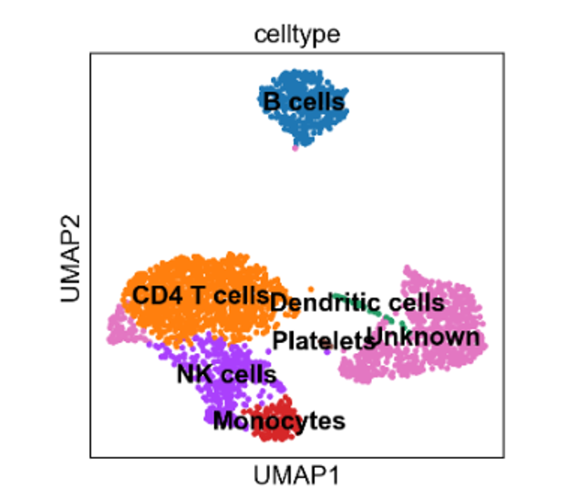
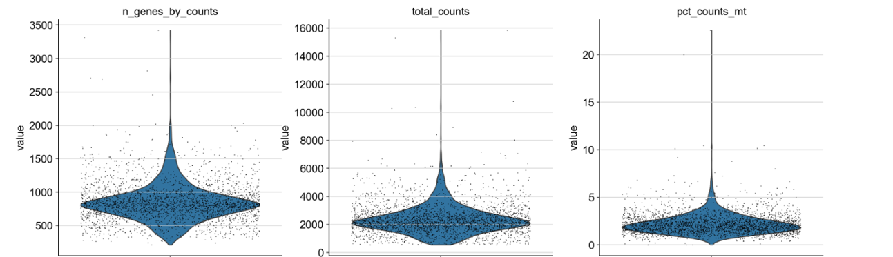
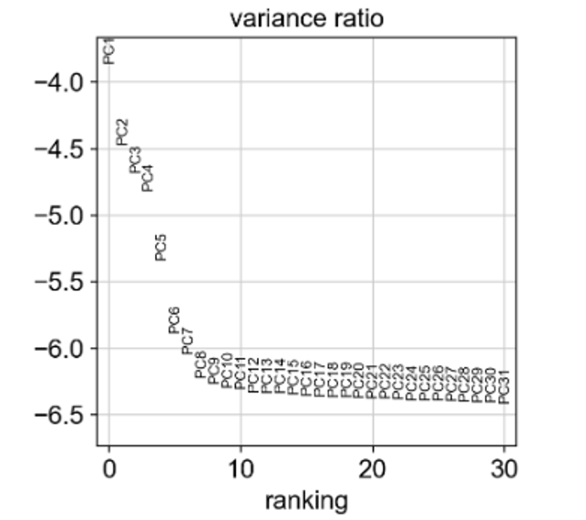
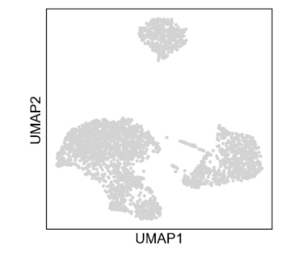
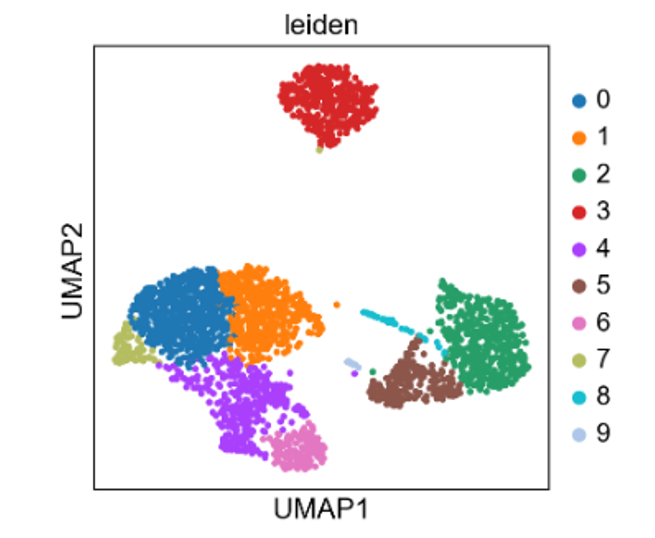
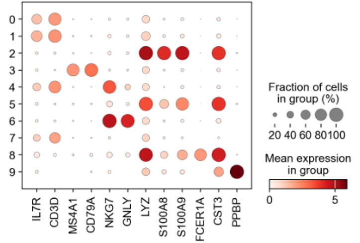
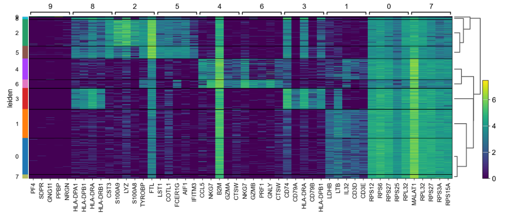

# Single-cell RNA-seq Cell Atlas of Human PBMCs

## Project Overview

This project presents an end-to-end single-cell RNA sequencing (scRNA-seq) analysis of human peripheral blood mononuclear cells (PBMCs) using the Scanpy framework in Python.

The goal of the study was to identify distinct immune cell populations, characterize their transcriptional profiles, and construct a reference PBMC cell atlas using unsupervised clustering and differential expression analysis.

Single-cell transcriptomics enables gene expression profiling at cellular resolution, allowing heterogeneous cell populations to be resolved beyond the capabilities of bulk RNA sequencing.

---

## Project Highlights

✔ Single-cell RNA-seq analysis using Scanpy

✔ Quality control and preprocessing of 2,700+ PBMCs

✔ UMAP visualization and Leiden clustering

✔ Differential expression analysis

✔ Marker-based cell type annotation

✔ Construction of a PBMC cell atlas

✔ Reproducible single-cell workflow

✔ Biological interpretation of immune cell populations

---

## Main Findings

### Immune cell populations can be accurately reconstructed using transcriptomic profiles

Unsupervised clustering identified major immune populations including T cells, B cells, NK cells, monocytes, dendritic cells, and platelets.

### Marker genes clearly define cellular identity

Differential expression analysis identified canonical marker genes consistent with known immune biology.

### Single-cell transcriptomics captures immune heterogeneity

Distinct transcriptional programs were observed across immune cell populations, demonstrating the ability of scRNA-seq to resolve cellular diversity.

### The computational workflow reproduces established PBMC cell atlases

Cluster assignments and marker genes were highly consistent with previously published PBMC analyses.

---
### Annotated PBMC Cell Atlas



The final annotated atlas identified major immune cell populations including T cells, B cells, NK cells, monocytes, dendritic cells, and platelets.

---

## Main Figures

### Quality Control



Quality control metrics used for filtering low-quality cells and potential doublets.

---

### PCA Elbow Plot



Selection of informative principal components for downstream analysis.

---

### UMAP Visualization



Low-dimensional representation of PBMC transcriptomic heterogeneity.

---

### Leiden Clustering



Unsupervised clustering identified transcriptionally distinct immune cell populations.

---

### Annotated Cell Atlas


Cell populations annotated using canonical immune marker genes.

---

### Marker Gene Dot Plot



Expression patterns of canonical marker genes across identified cell populations.

---

### Marker Gene Heatmap



Differential expression patterns defining immune cell identities.

---

## Objectives

* Perform quality control and filtering of single-cell RNA-seq data
* Normalize and preprocess gene expression counts
* Identify highly variable genes
* Reduce dimensionality using PCA and UMAP
* Perform unsupervised clustering (Leiden algorithm)
* Identify marker genes using differential expression analysis
* Assign biological cell types based on known immune markers

---

## Dataset

The dataset was obtained from the Scanpy built-in dataset:

`sc.datasets.pbmc3k()`

It contains ~2,700 human peripheral blood mononuclear cells generated using droplet-based single-cell RNA sequencing technology.

The dataset is widely used as a benchmark for learning and validating single-cell analysis workflows.

---

## Computational Workflow

1. Data loading
2. Quality control filtering
3. Library size normalization
4. Log transformation
5. Highly variable gene selection
6. PCA
7. k-nearest neighbor graph construction
8. UMAP visualization
9. Leiden clustering
10. Marker gene identification
11. Cell type annotation

---

## Identified Cell Types

* CD4 T cells (IL7R, CD3D)
* B cells (MS4A1, CD79A)
* Natural Killer (NK) cells (NKG7, GNLY)
* Monocytes (LYZ, S100A8, S100A9)
* Dendritic cells (FCER1A, CST3)
* Platelets (PPBP)

---

 ## Key Results 

* 2638 high-quality cells remained after filtering
* Unsupervised clustering revealed 10 transcriptionally distinct populations
* Marker gene analysis confirmed known immune cell identities
* Differential expression analysis demonstrated unique transcriptional signatures for each cell type

---

## Biological Interpretation

The results demonstrate that transcriptional profiles alone are sufficient to distinguish immune cell populations without prior labeling. Cells cluster according to biological function, indicating that gene expression patterns strongly correlate with cellular identity.

This project highlights the power of single-cell RNA sequencing to study immune heterogeneity and provides a reproducible workflow for analysing high-dimensional transcriptomic data.

---

## Potential Applications

* Immunology research
* Cancer immunology
* Biomarker discovery
* Precision medicine
* Drug development
* Clinical transcriptomics workflows
* Infectious disease research
* Reference immune atlas construction

---

## Skills Demonstrated

### Single-Cell Transcriptomics

* Quality control and filtering
* Highly variable gene selection
* PCA and UMAP
* Leiden clustering
* Differential expression analysis

### Computational Biology

* Scanpy workflows
* Transcriptomic data analysis
* Cell type annotation
* Biological interpretation

### Tools

* Python
* Scanpy
* AnnData
* Pandas
* NumPy
* Matplotlib
* Seaborn
* JupyterLab

---

## Requirements

* Python 3.10
* Scanpy
* Anndata
* NumPy
* Pandas
* Matplotlib
* Seaborn
* Leidenalg
* igraph
* JupyterLab

---

## How to Reproduce the Analysis

```bash
conda env create -f environment.yml
conda activate scrna-pbmc
jupyter lab
```

Open:

```text
notebooks/01_pbmc_cell_atlas.ipynb
```

Run all cells sequentially.

---

## Limitations

* Dropout events and sparse gene expression matrices
* Technical noise from sequencing
* Possible doublets
* Batch effects (not present in single dataset)
* Lack of spatial information

---

## References

Key references are listed in the accompanying report PDF.

---
## License

This repository is provided for educational and portfolio purposes.

---

## Author

**Agata Gabara**

MSc Bioinformatics Student

Research Interests:

* Single-Cell Transcriptomics
* Cancer Genomics
* Computational Biology
* Immunology
* Multi-Omics Integration

GitHub: https://github.com/ag48665

LinkedIn: https://www.linkedin.com/in/agatha-gabara-06494a37/
